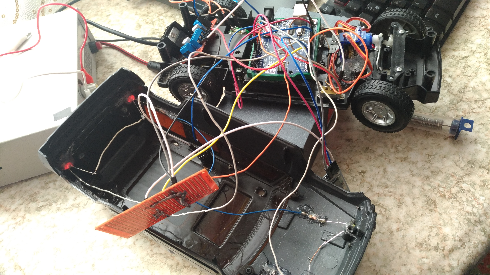
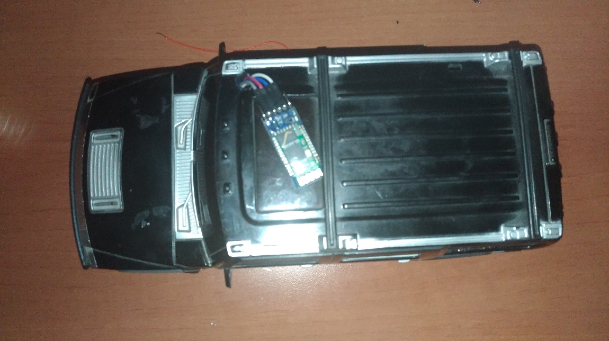
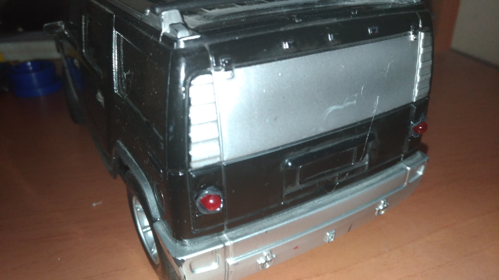
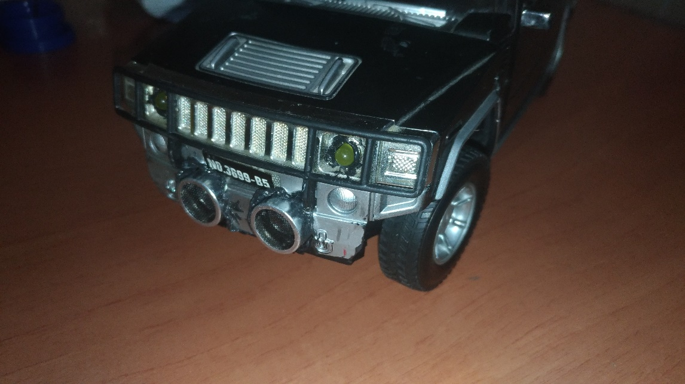
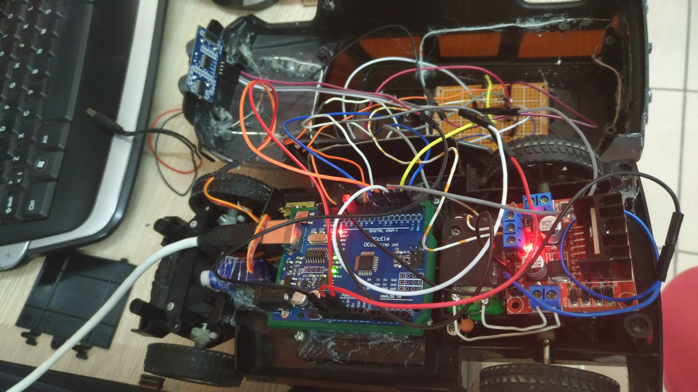
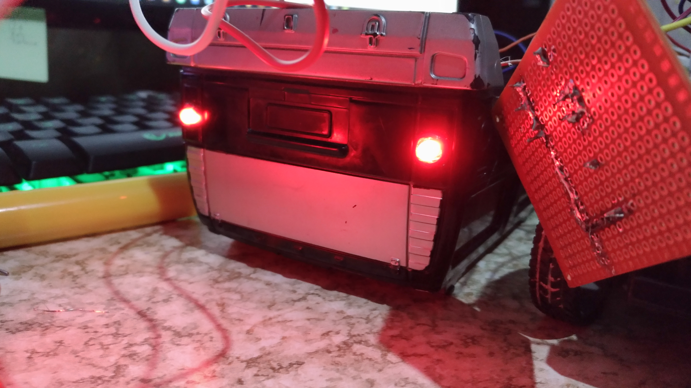
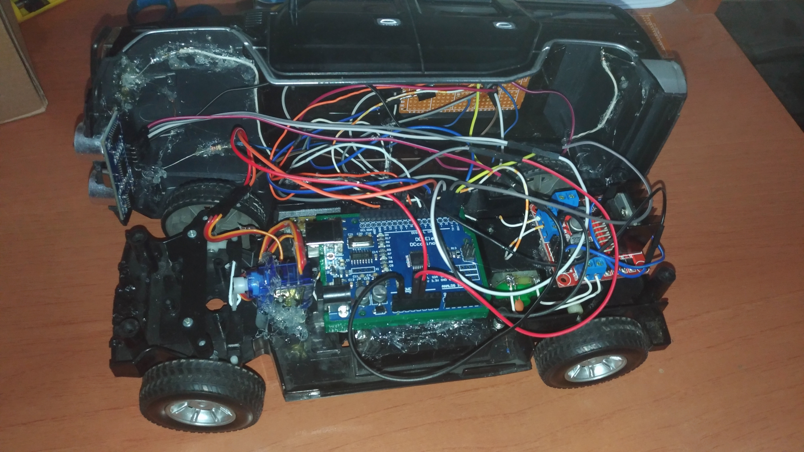

# Arduino RC(Remote Control) Car Bluetooth Projesi

  ## Nedir?

  Arduino temelli bluetooth ile kontrol edilebilen sensörlü Uzaktan Kontrollü(RC) araba projesi.

  ## Özellikleri

  * Bluetooth ile uzaktan kontrol
  * Önünde, 10 cm'den daha yakın bir nesne olduğunda durmakta.
  * Ön farlar.
  * Arka stop lambaları.
  * Servo metor ile dönüş kabileyeti.
  * Korna
  * Dörtlü yanıp sönme.

  ## Kullanılan Donanımlar

  * Arduino UNO
  *	L298N Motor Sürücü
  *	HC-05 Bluetooth Modülü
  *	1 adet DC motor
  *	1 adet Servo motor
  *	1 tane anahtar 
  *	4 adet tekerli uzaktan kumandalı araba şasesi
  *	HC-SR04 Ultra Sonic Mesafe Sensörü
  *	5 AA 1.5V Pil ve 1 Adet 9V pil
  *	2 Tane Kırmızı Led
  * 2 Tane Sarı Led
  * Buzzer
  * Yeterince kablo
  *	Delikli devre kartı
  
  ## Kullanılan Yazılımlar
  * Bluetooth ile araba kontrolü için kullanılan mobil uygulama
    - https://play.google.com/store/apps/details?id=com.electro_tex.bluetoothcar&hl=tr
  * Arduino
    - https://www.arduino.cc/en/Main/Software
  * VS Code
    - https://code.visualstudio.com/

  ## Görseller

  
  
  
  
  
  
  

  ## Video

  

  ## Öneriler

  * Aynı anda birden fazla işlem (thread, örnek olarak sinyal verirken arabayı da kontrol etmek için) yapmak için “TimedAction.h” kütüphanesi kullanılabilir.

  ## Benzer Projeler

  -	http://www.ardumotive.com/bluetooth-rc-car.html
  -	https://create.arduino.cc/projecthub/Yogeshmodi/bluetooth-controlled-car-e8c90e
  -	https://circuitdigest.com/microcontroller-projects/bluetooth-controlled-robot-car-using-arduino

  ## Kaynakça
  -	https://playground.arduino.cc/Code/TimedAction
  - https://www.arduino.cc/reference/en/
  - https://cdn.makezine.com/uploads/2014/03/hc_hc-05-user-instructions-bluetooth.pdf
  - http://www.toptechboy.com/arduino-lessons/
  - http://www.micropik.com/PDF/HCSR04.pdf
  - https://opencircuit.shop/ProductInfo/1000189/L298N-module-informatie.pdf
  - https://gelecegiyazanlar.turkcell.com.tr/konu/arduino
  - https://www.youtube.com/channel/UCnD05oNu5qPq_FwF_jfWIlg
